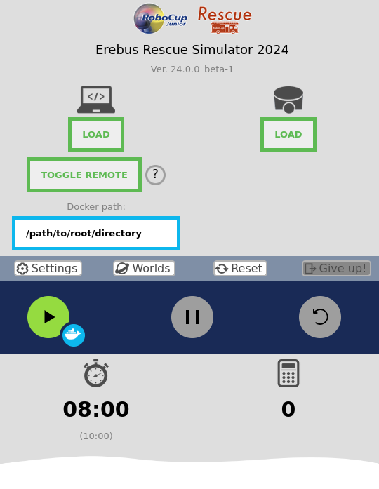

# Getting Started

Our aim with running Erebus robot controllers in docker containers is to make installation and
deployment of your code easy for tournament organisers. This document outlines some of
the technical base for creating docker images, and some examples to get you started.

**Note: Running any GUI, such as OpenCV show image, will not work since no graphical server is set up within the container by default.**

## Contents

- [Getting Started](#getting-started)
  - [Contents](#contents)
  - [Understanding Docker Images](#understanding-docker-images)
  - [Erebus Base Image](#erebus-base-image)
    - [From Docker hub (Recommended)](#from-docker-hub-recommended)
    - [Building manually](#building-manually)
    - [What's in the "base image"?](#whats-in-the-base-image)
  - [Understanding the Python example `Dockerfile`](#understanding-the-python-example-dockerfile)
  - [Running a container](#running-a-container)
    - [Via Erebus Client](#via-erebus-client)
    - [Manually](#manually)
      - [Building](#building)
      - [Running](#running)
- [Converting your project](#converting-your-project)
  - [Example: Team Talon (Python)](#example-team-talon-python)
    - [Dockerfile](#dockerfile)
  - [Example: C++](#example-c)
    - [`main.cpp`](#maincpp)
    - [`Makefile.include`](#makefileinclude)
    - [`Makefile`](#makefile)
    - [Dockerfile](#dockerfile-1)
    - [Use with Visual Studio](#use-with-visual-studio)

## Understanding Docker Images

Docker is used to "containerize" your application so it can be deployed easily
across computers. It uses virtual machines to contain your code within pre-defined
environments.

A docker image is a contained "image" of how to set up and run a virtual environment, containing an isolated filesystem. This isolated filesystem is provided by an image, and should contain everything needed to build and run an application. We create an image to describe exactly how to set up software
in order to run the code we want.
Building and running a docker image creates a sandboxed process isolated from the host system, this is called a container. 

How to build an image is described within a `Dockerfile`. These are effectively a simple
set of steps of how to set up the virtual machine your code will live in. 
When telling docker how to set up the environment, we can also install any 
dependencies we may need. To increase reusability, we can use one image as a "base" for how to create another.

It is important to note that these environments run in Linux. You can read more about the basics of Docker [here](https://docs.docker.com/get-started/).

## Erebus Base Image

The aim for the "base image" is to install everything you need for generic Erebus controller development on Linux, designed to make `Dockerfile` development for your project quick and easy.

It is intended as a base to use for creating your own docker images (we will cover more about this later). However, it is not required to use this image, **but it very helpful as a baseline
for simple projects**. More complicated projects may need to customise their container
installs further as needed.

This image can be download from DockerHub (recommended), or built yourself.

### From Docker hub (Recommended)

You can pull the image from Docker hub:

```bash
docker pull alfredroberts/erebus
```

### Building manually

If you would like to manually build the image on your machine, you can build the
image with the following command:

``` bash
docker build . --tag alfredroberts/erebus [--build-arg WEBOTS_VERSION=R2023b] [--build-arg WEBOTS_PACKAGE_PREFIX=_ubuntu-22.04]
```

### What's in the "base image"?

The following general steps are completed when building the image:

1. Step up the environment for Ubuntu (Version 22.04)
2. Install Webots. This stage is important to include the controller libraries
every controller relies on.
3. Install C/C++ build tools.
4. Install OpenCV libraries required for OpenCV development on Linux. The python
opencv module is also installed using pip.
5. Environmental variables are updated to add webots library paths to be found
by python.
6. The default working directory is set as `/user/local/`.
7. Finally, it runs `CMD ["/bin/bash"]`. This is important as this enables your
`Dockerfile` to run commands within the bash terminal (so you can run linux commands).

As listed above, the image fully installs all tools for C/C++ and python, along
with installing OpenCV libraries as it become essential for a lot of Erebus controller development.

## Understanding the Python example `Dockerfile`

With the understanding of what the "base image" does, lets look at a simple python example (from `./examples/python`). For further insight into how to write dockerfiles, uou can read more about the syntax [here](). 

```dockerfile
# syntax=docker/dockerfile:1

FROM alfredroberts/erebus

# Create a directory for my controller code to go
RUN mkdir -p /usr/local/controller
WORKDIR /usr/local/controller

# Copy my controller code from the dir my dockerfile is in to my
# current (work) directory
COPY . .
# Install any python requirements needed
RUN pip3 install -r requirements.txt

# Run my controller (using extern controller helper)
CMD webots-controller --protocol=tcp --ip-address=$EREBUS_SERVER --port=1234 --robot-name=Erebus_Bot --stdout-redirect --stderr-redirect bot.py
```

Lets go through this line by line:

```dockerfile
FROM alfredroberts/erebus
```
This line loads our base image. When building your image, this will be run first
to set up the environment. This means we don't need to worry about installing OpenCV etc.

```dockerfile
# Create a directory for my controller code to go
RUN mkdir -p /usr/local/controller
WORKDIR /usr/local/controller
```
`RUN` allows you to run some command within the bash terminal we are in (remember from the base image explanation). We create a new directory for our project to live in, I've chosen some arbitrary location `/usr/local/controller`.

We can then set our current working directory (e.g. the directory subsequent commands with work within) to be the directory we just created with `WORKDIR /usr/local/controller`.

```dockerfile
# Copy my controller code from the dir my dockerfile is in to my
# current (work) directory
COPY . .
```
This line may be a bit confusing, but effectively we are copying all the files within
your project's root directory (the directory with the `Dockerfile` in) to our
working directory within the container.


```dockerfile
# Install any python requirements needed
RUN pip3 install -r requirements.txt
```
Here, we install the dependencies we need for our code to run. In this python example,
I have included a `requirements.txt` file in the project directory to make
installing packages easy. You could alternatively add multiple `RUN pip3 install ...` commands to
install the packages you'd like.

We now have all our code and dependencies installed in our VM, we just need to run it!

```dockerfile
# Run my controller (using extern controller helper)
CMD webots-controller --protocol=tcp --ip-address=$EREBUS_SERVER --port=1234 --robot-name=Erebus_Bot --stdout-redirect --stderr-redirect bot.py
```

This is the important line to run our controller. Webots provides a program to run controllers called `webots-controler`. It makes running controllers within docker containers easy. 

We pass in an important environment variable `$EREBUS_SERVER`. This is used to specify the IP of the Webots client you want to connect to. 

This line needs to be in every dockerfile you create to be able to run a robot controller. The only part you need to modify is the last part to specify the entry point of your controller. In this example its the python file `bot.py`.

**Do not motify any other part of this line otherwise the Erebus docker helper
may not be able to build and run your docker image**

## Running a container

### Via Erebus Client

It is advised to build and run your project's image via the Erebus client's UI. It will automatically build and run the controller for you. You also don't need to specify any IP address, Erebus will find it for you!

All you need to do is specify the root directory of your project. This will be the directory containing your `Dockerfile`.



Once the docker path is set, you can run your project within a container by pressing the docker play button (the blue button next to the play button). This will build and run your controller for you. The stdout will be piped to the Webots console.

### Manually

*Please note: This is not the recommended method and should only be used if absolutely necessary*

#### Building

To build and run a container, run the following:

With the working directory being `cpp/` or `python/`, to build the image, run:

``` bash
docker build --tag my_awesome_controller .
```

#### Running

> As a current limitation, since the docker container uses Webots extern controllers, so you must manually set your LAN ip as an environment variable, e.g: 192.168.1.1

With Erebus waiting for a remote connection, run:

```bash
docker run --env EREBUS_SERVER=my.ip.address my_awesome_controller
```

# Converting your project

Converting your project to work as a docker container should be straightforward as long as your code is cross-platform. If you use any packages or code that is platform specific (e.g. only for Windows), your code cannot run within a docker container and you will have to alter your code.

Getting a python project running is very simple, and shouldn't require much or any alteration of the example `Dockerfile` given within this repository (given you
install dependencies using a `requirements.txt` file).

Getting a C/C++ project running may require a few more steps to get dependencies built correctly on Linux. However, if your code mainly relies on OpenCV, conversion should be simple.

## Example: Team Talon (Python)

This is a real-world example of converting the Team Talon [open-source project](https://github.com/iita-robotica/rescate_laberinto) running within a docker container.

### Dockerfile
```dockerfile
# syntax=docker/dockerfile:1

FROM alfredroberts/erebus

# Create a directory for my controller code to go
RUN mkdir -p /usr/local/controller
WORKDIR /usr/local/controller

# Copy my controller code from the dir my dockerfile is in to my
# current (work) directory
COPY . .
# Install any python requirements needed
RUN pip3 install -r requirements.txt

# Run my controller (using extern controller helper)
CMD webots-controller --protocol=tcp --ip-address=$EREBUS_SERVER --port=1234 --robot-name=Erebus_Bot --stdout-redirect --stderr-redirect compiled.py
```

As said above, python dockerfiles need almost nothing altered from the examples.

In the last line, we point the project's entry point to the `compiled.py` file, which is the project's file for compiling multiple source files into one.

## Example: C++

In this example, we will show how we can create a project that can continue development within Visual Studio on Windows, and still be compilable in Linux (and therefore a docker container).

This example uses the official Webots `makefile` exclusively. You can see the
documentation in `$(WEBOTS_HOME_PATH)/resources/Makefile.include` of your Webots
install (also listed below).

Within the project, we have the files:
- `main.cpp`
- `Makefile`
- `Makefile.include`
- `Dockerfile`
- Various visual studio files needed for opening the project in a solution.


### `main.cpp`
```c++
#include <webots/Robot.hpp>

#include <opencv2/core/core.hpp>
#include <opencv2/imgproc/imgproc.hpp>

using namespace webots;

int main(int argc, char **argv) {
  // create the Robot instance.
  Robot *robot = new Robot();

  // get the time step of the current world.
  int timeStep = (int)robot->getBasicTimeStep();

  printf("OpenCV Version: %s\n", cv::getBuildInformation().c_str());

  while (robot->step(timeStep) != -1) {
    printf("Running successfully!\n");
  };

  delete robot;
  return 0;
}

```
This is a very simple controller that create a robot object, prints some OpenCV version information to ensure OpenCV has been installed and linked correctly, and prints something when the robot is stepping the simulation.

### `Makefile.include`

Since we are compiling for Linux, we will use cmake. CMake has a bit of a learning curve, however, thanks to a Makefile Webots provides (`Makefile.include`), it makes building our projects much easier. Users building on Linux may already have experience with these
Webots build tools. You can learn more about getting started with CMake [here](https://cmake.org/cmake/help/latest/guide/tutorial/A%20Basic%20Starting%20Point.html).

We will use both the `Makefile` and `Makefile.include` files provided by Webots.

**I would recommend copying and using the `Makefile.include` file included in the C++ example project (modified official makefiles provided by Webots to work best in Docker) instead of trying to compile your project from scratch in CMake.**

### `Makefile`

```makefile
# Do not modify the following: this includes Webots global Makefile.include
null :=
space := $(null) $(null)
WEBOTS_HOME_PATH?=$(subst $(space),\ ,$(strip $(subst \,/,$(WEBOTS_HOME))))

### ------------------------------------------------
# Custom variables for Makefile.include

# Compile flags + libs needed for OpenCV compilation
NAME = main
CFLAGS = `pkg-config --cflags opencv4`
LIBRARIES = `pkg-config --libs opencv4` -lopencv_core -lopencv_imgproc
### -----------------------------------------------

# Do not modify the following:
include Makefile.include
```

This is (a slightly modified) `Makefile` provided by Webots for building C/C++ controllers. Here, we set the variable `NAME = main` to name our compiled file output. It also compiles any files called `main`, which is what we want (without having to use `C_SOURCES` or `CXX_SOURCES`, for simplicity).

If you needed to add more files to be compiled, you would simply specify more files using the custom variables for `Makefile.include` (see documentation below).

The following line:
```makefile
CFLAGS = `pkg-config --cflags opencv4`
``` 
is used to specify compilation flags. Here, we set the flags to ones we need to compile any OpenCV files needed. Since OpenCV is already installed for us, we can just query `opencv4` to find the correct flags using `pkg-config`.

Similarly, for library linking:
```makefile
LIBRARIES = `pkg-config --libs opencv4` -lopencv_core -lopencv_imgproc
```
we search for `opencv4`, and also add the flags `-lopencv_core` and `-lopencv_imgproc`, which are needed to link the necessary files for OpenCV.

To include multiple source files and linking options, see the official documentation for using the Makefile found in the comments of the `Makefile.include`:

```
# Webots Makefile system 
#
# You may add some variable definitions hereafter to customize the build process
# See documentation in below:

### Generic Makefile.include for Webots controllers, physics plugins, robot
### window libraries, remote control libraries and other libraries
### to be used with GNU make
###
### Platforms: Windows, macOS, Linux
### Languages: C, C++
###
### Authors: Olivier Michel, Yvan Bourquin, Fabien Rohrer
###          Edmund Ronald, Sergei Poskriakov
###
###-----------------------------------------------------------------------------
###
### This file is meant to be included from the Makefile files located in the
### Webots projects subdirectories. It is possible to set a number of variables
### to customize the build process, i.e., add source files, compilation flags,
### include paths, libraries, etc. These variables should be set in your local
### Makefile just before including this Makefile.include. This Makefile.include
### should never be modified.
###
### Here is a description of the variables you may set in your local Makefile:
###
### ---- C Sources ----
### if your program uses several C source files:
### C_SOURCES = my_plugin.c my_clever_algo.c my_graphics.c
###
### ---- C++ Sources ----
### if your program uses several C++ source files:
### CXX_SOURCES = my_plugin.cc my_clever_algo.cpp my_graphics.c++
###
### ---- Compilation options ----
### if special compilation flags are necessary:
### CFLAGS = -Wno-unused-result
###
### ---- Linked libraries ----
### if your program needs additional libraries:
### INCLUDE = -I"/my_library_path/include"
### LIBRARIES = -L"/path/to/my/library" -lmy_library -lmy_other_library
###
### ---- Linking options ----
### if special linking flags are needed:
### LFLAGS = -s
###
### ---- Webots included libraries ----
### if you want to use the Webots C API in your C++ controller program:
### USE_C_API = true
###
### ---- Debug mode ----
### if you want to display the gcc command line for compilation and link, as
### well as the rm command details used for cleaning:
### VERBOSE = 1
###
###-----------------------------------------------------------------------------
```

### Dockerfile
```dockerfile
# syntax=docker/dockerfile:1

FROM alfredroberts/erebus

# Create a directory for my controller code to go
RUN mkdir -p /usr/local/controller
WORKDIR /usr/local/controller

# Copy my controller code from the dir my dockerfile is in to my
# current (work) directory
COPY . .
# Compile my controller
RUN make

# Run my controller (using extern controller helper)
CMD webots-controller --protocol=tcp --ip-address=$EREBUS_SERVER --port=1234 --robot-name=Erebus_Bot main
```

This is very similar to the python example. The only difference is we need to build our project before we can run it. We do this with `RUN make`. This will compile the project using CMake with the output being a file with the name we gave specified in the `makefile`, which in this case is `main`.

Therefore, we point the last line to run our file `main`.

### Use with Visual Studio

Since the code is cross-platform, we can build the controller on Windows the same as normal. That is, we can tell Visual Studio to point to OpenCV files needed for compilation and linking within the project settings. We can imagine these files are pre-installed on our Windows machine (e.g. downloaded from OpenCV's website).

Therefore, the only difference between building for Windows and for within a docker container is how we compile and link libraries. While it is possible to include OpenCV as part of your project files and compile it along with the rest of your code, it is advised against to try and reduce the size of your docker image.